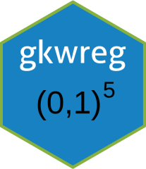

<!-- README.md is generated from README.Rmd. Please edit that file -->

```{r, include = FALSE}
knitr::opts_chunk$set(
  collapse = TRUE,
  echo = TRUE,
  eval = FALSE,
  comment = "#>",
  fig.path = "man/figures/README-",
  out.width = "100%"
)
```


# gkwreg: Generalized Kumaraswamy Regression Models for Bounded Data 

[](https://CRAN.R-project.org/package=gkwreg)
[](https://github.com/evandeilton/gkwreg/actions/workflows/R-CMD-check.yaml)
[](https://cran.r-project.org/package=gkwreg)
[](https://opensource.org/licenses/MIT)

## Overview

The **gkwreg** package provides a comprehensive and computationally efficient framework for regression modeling of data restricted to the standard unit interval (0, 1), including proportions, rates, fractions, percentages, and bounded indices. While Beta regression is the traditional approach for such data, **gkwreg** focuses on the **Generalized Kumaraswamy (GKw)** distribution family, offering exceptional flexibility by encompassing seven important bounded distributions—including Beta and Kumaraswamy—as special or limiting cases.

The package enables full **distributional regression**, where *all* relevant parameters can be modeled as functions of covariates through flexible link functions. Maximum Likelihood estimation is performed efficiently via the **Template Model Builder (TMB)** framework, leveraging **Automatic Differentiation (AD)** for superior computational speed, numerical accuracy, and optimization stability.

---

## Key Features

### 📊 Flexible Distribution Hierarchy

Model bounded data using the **5-parameter Generalized Kumaraswamy (GKw)** distribution and its **seven nested subfamilies**:

| Distribution                | Code   | Parameters Modeled                        | Fixed Parameters                         | # Params |
|:----------------------------|:-------|:------------------------------------------|:-----------------------------------------|:---------|
| Generalized Kumaraswamy     | `gkw`  | α, β, γ, δ, λ                            | None                                     | 5        |
| Beta-Kumaraswamy            | `bkw`  | α, β, γ, δ                               | λ = 1                                    | 4        |
| Kumaraswamy-Kumaraswamy     | `kkw`  | α, β, δ, λ                               | γ = 1                                    | 4        |
| Exponentiated Kumaraswamy   | `ekw`  | α, β, λ                                  | γ = 1, δ = 0                             | 3        |
| McDonald (Beta Power)       | `mc`   | γ, δ, λ                                  | α = 1, β = 1                             | 3        |
| Kumaraswamy                 | `kw`   | α, β                                     | γ = 1, δ = 0, λ = 1                      | 2        |
| Beta                        | `beta` | γ, δ                                     | α = 1, β = 1, λ = 1                      | 2        |

Each family offers distinct flexibility-parsimony tradeoffs. Start simple (`kw` or `beta`) and compare nested models using likelihood ratio tests or information criteria.

### 🎯 Advanced Regression Modeling

- **Extended formula syntax** for parameter-specific linear predictors:
  ```r
  y ~ alpha_predictors | beta_predictors | gamma_predictors | delta_predictors | lambda_predictors
  ```
  Example: `yield ~ batch + temp | temp | 1 | temp | batch`

- **Multiple link functions** with optional scaling:
  - **Positive parameters** (α, β, γ, λ): `log` (default), `sqrt`, `inverse`, `identity`
  - **Probability parameters** (δ ∈ (0,1)): `logit` (default), `probit`, `cloglog`, `cauchy`
  - **Link scaling**: Control transformation intensity via `link_scale` (useful for numerical stability)

- **Flexible control** via `gkw_control()`:
  - Multiple optimizers: `nlminb` (default), `BFGS`, `Nelder-Mead`, `CG`, `SANN`, `L-BFGS-B`
  - Custom starting values, convergence tolerances, iteration limits
  - Fast fitting mode (disable Hessian computation for point estimates only)
  - Debugging tools (verbose output, trace levels)

### ⚡ Computational Efficiency

- **TMB-powered estimation**: Compiled C++ templates with automatic differentiation
  - Exact gradients and Hessians (machine precision)
  - 10-100× faster than numerical differentiation
  - Superior convergence stability

- **Performance optimizations**:
  - Intelligent caching of intermediate calculations
  - Vectorized operations via Eigen/Armadillo
  - Memory-efficient for large datasets (n > 100,000)

### 🔬 Comprehensive Inference Tools

**Standard R Methods** (familiar workflow):
- `summary()`, `print()`, `coef()`, `vcov()`, `confint()`
- `logLik()`, `AIC()`, `BIC()`, `nobs()`
- `fitted()`, `residuals()`, `predict()`
- `anova()` for nested model comparisons

**Advanced Prediction** (`predict.gkwreg`):
- Multiple prediction types:
  - `"response"`: Expected mean E(Y|X)
  - `"parameter"`: All parameter values (α, β, γ, δ, λ)
  - `"link"`: Linear predictors (before inverse link)
  - `"variance"`: Predicted variance Var(Y|X)
  - `"density"`, `"probability"`, `"quantile"`: Distribution functions at specified values
- Element-wise or vectorized evaluation
- Predictions under alternative distributional assumptions

**Model Comparison**:
- Likelihood ratio tests: `anova()`, `lrtest()`
- Information criteria: `AIC()`, `BIC()` with multi-model comparison
- Automated nesting detection and proper test statistics

### 📈 Sophisticated Diagnostics

**6 Diagnostic Plot Types** (`plot.gkwreg`):
1. **Residuals vs Observation Indices**: Detect autocorrelation, temporal patterns
2. **Cook's Distance**: Identify influential observations (threshold: 4/n)
3. **Leverage vs Fitted Values**: Flag high-leverage points (threshold: 2p/n)
4. **Residuals vs Linear Predictor**: Check linearity, heteroscedasticity
5. **Half-Normal Plot with Simulated Envelope**: Assess distributional adequacy
6. **Predicted vs Observed**: Overall goodness-of-fit

**Advanced Features**:
- **Dual graphics systems**: Base R (fast) or ggplot2 (publication-quality)
- **Multiple residual types**: Quantile (default), Pearson, Deviance
- **Customizable**: Named-list interface for titles, themes, arrangement
- **Performance**: Automatic sampling for large datasets, adjustable envelope simulations
- **Programmatic access**: `save_diagnostics = TRUE` returns computed measures

### 🔗 Ecosystem Integration

- **Distribution functions** via companion package [`gkwdist`](https://github.com/evandeilton/gkwdist):
  - Density (`dgkw`, `dkw`, `dbeta`, etc.)
  - CDF (`pgkw`, `pkw`, `pbeta`, etc.)
  - Quantile (`qgkw`, `qkw`, `qbeta`, etc.)
  - Random generation (`rgkw`, `rkw`, `rbeta`, etc.)
  - All implemented in optimized C++ for speed

- **Seamless compatibility** with R ecosystem:
  - `broom`: `tidy()`, `glance()`, `augment()` methods (if available)
  - `tidyverse`: Works naturally with `dplyr`, `ggplot2` pipelines
  - Standard workflows: Model selection, cross-validation, bootstrapping

---

## Installation

```r
# Install from CRAN (stable release):
install.packages("gkwreg")

# Install companion distribution package:
install.packages("gkwdist")

# Or install development versions from GitHub:
# install.packages("devtools")
devtools::install_github("evandeilton/gkwdist")
devtools::install_github("evandeilton/gkwreg")
```

---

## Quick Start

### Basic Regression

```{r}
library(gkwreg)
library(gkwdist)

# Simulate data
set.seed(123)
n <- 500
x1 <- runif(n, -2, 2)
x2 <- rnorm(n)

# True parameters (log link)
alpha_true <- exp(0.8 + 0.3*x1)
beta_true  <- exp(1.2 - 0.2*x2)

# Generate response from Kumaraswamy distribution
y <- rkw(n, alpha = alpha_true, beta = beta_true)
y <- pmax(pmin(y, 1 - 1e-7), 1e-7)  # Ensure strict bounds
df <- data.frame(y = y, x1 = x1, x2 = x2)

# Fit Kumaraswamy regression
# Formula: alpha ~ x1, beta ~ x2 (intercept-only models also supported)
fit_kw <- gkwreg(y ~ x1 | x2, data = df, family = "kw")

# View results
summary(fit_kw)
```

### Advanced Prediction

```{r}
# Create prediction grid
newdata <- data.frame(
  x1 = seq(-2, 2, length.out = 100),
  x2 = 0
)

# Predict different quantities
pred_mean  <- predict(fit_kw, newdata, type = "response")    # E(Y|X)
pred_var   <- predict(fit_kw, newdata, type = "variance")    # Var(Y|X)
pred_alpha <- predict(fit_kw, newdata, type = "alpha")       # α parameter
pred_params <- predict(fit_kw, newdata, type = "parameter")  # All parameters

# Evaluate density at y = 0.5 for each observation
dens_values <- predict(fit_kw, newdata, type = "density", at = 0.5)

# Compute quantiles (10th, 50th, 90th percentiles)
quantiles <- predict(fit_kw, newdata, type = "quantile", 
                     at = c(0.1, 0.5, 0.9), elementwise = FALSE)
```

### Model Comparison

```{r}
# Fit nested models
fit0 <- gkwreg(y ~ 1,      data = df, family = "kw")  # Null model
fit1 <- gkwreg(y ~ x1,     data = df, family = "kw")  # + x1
fit2 <- gkwreg(y ~ x1 | x2, data = df, family = "kw") # + x2 on beta

# Information criteria comparison
AIC(fit0, fit1, fit2)

# Likelihood ratio tests
anova(fit0, fit1, fit2, test = "Chisq")
```

### Diagnostic Plots

```{r}
# All diagnostic plots (base R graphics)
par(mfrow = c(3, 2))
plot(fit_kw, ask = FALSE)

# Select specific plots with customization
plot(fit_kw, 
     which = c(2, 5, 6),           # Cook's distance, Half-normal, Pred vs Obs
     type = "quantile",             # Quantile residuals (recommended)
     caption = list(
       "2" = "Influential Points",
       "5" = "Distributional Check"
     ),
     nsim = 200,                    # More accurate envelope
     level = 0.95)                  # 95% confidence

# Modern ggplot2 version with grid arrangement
plot(fit_kw, 
     use_ggplot = TRUE, 
     arrange_plots = TRUE,
     theme_fn = ggplot2::theme_bw)

# Extract diagnostic data for custom analysis
diag <- plot(fit_kw, save_diagnostics = TRUE)
head(diag$data)  # Access Cook's distance, leverage, residuals, etc.
```

---

## Real Data Example

```{r}
# Food Expenditure Data (proportion spent on food)
data("FoodExpenditure")
food <- FoodExpenditure
food$prop <- food$food / food$income

# Fit different distributional families
fit_beta <- gkwreg(prop ~ income + persons, data = food, family = "beta")
fit_kw   <- gkwreg(prop ~ income + persons, data = food, family = "kw")
fit_ekw  <- gkwreg(prop ~ income + persons, data = food, family = "ekw")

# Compare families
comparison <- data.frame(
  Family = c("Beta", "Kumaraswamy", "Exp. Kumaraswamy"),
  LogLik = c(logLik(fit_beta), logLik(fit_kw), logLik(fit_ekw)),
  AIC = c(AIC(fit_beta), AIC(fit_kw), AIC(fit_ekw)),
  BIC = c(BIC(fit_beta), BIC(fit_kw), BIC(fit_ekw))
)
print(comparison)

# Visualize best fit
best_fit <- fit_kw
plot(food$income, food$prop, 
     xlab = "Income", ylab = "Food Proportion",
     main = "Food Expenditure Pattern", pch = 16, col = "gray40")
income_seq <- seq(min(food$income), max(food$income), length = 100)
pred_df <- data.frame(income = income_seq, persons = median(food$persons))
lines(income_seq, predict(best_fit, pred_df), col = "red", lwd = 2)
```

---

## Advanced Features

### Custom Optimization Control

```{r}
library(gkwreg)
library(gkwdist)

# Simulate data
set.seed(123)
n <- 500
x  <- runif(n, 1, 5)
x1 <- runif(n, -2, 2)
x2 <- rnorm(n)
x3 <- rnorm(n, 1, 4)

# True parameters (log link)
alpha_true <- exp(0.8 + 0.3*x1)
beta_true  <- exp(1.2 - 0.2*x2)

# Generate response from Kumaraswamy distribution
y <- rkw(n, alpha = alpha_true, beta = beta_true)
y <- pmax(pmin(y, 1 - 1e-7), 1e-7)  # Ensure strict bounds
df <- data.frame(y = y, x = x, x1 = x1, x2 = x2, x3 = x3)

# Default control (used automatically)
fit <- gkwreg(y ~ x1, data = df, family = "kw")

# Increase iterations for difficult problems
fit_robust <- gkwreg(y ~ x1, data = df, family = "kw",
                     control = gkw_control(maxit = 1000, trace = 1))

# Try alternative optimizer
fit_bfgs <- gkwreg(y ~ x1, data = df, family = "kw",
                   control = gkw_control(method = "BFGS"))

# Fast fitting without standard errors (exploratory analysis)
fit_fast <- gkwreg(y ~ x1, data = df, family = "kw",
                   control = gkw_control(hessian = FALSE))

# Custom starting values
fit_custom <- gkwreg(y ~ x1 + x2 | x3, data = df, family = "kw",
                     control = gkw_control(
                       start = list(
                         alpha = c(0.5, 0.2, -0.1),  # Intercept + 2 slopes
                         beta  = c(1.0, 0.3)         # Intercept + 1 slope
                       )
                     ))
```

### Link Functions and Scaling

```{r}
# Default: log link for all parameters
fit_default <- gkwreg(y ~ x | x, data = df, family = "kw")

# Custom link functions per parameter
fit_links <- gkwreg(y ~ x | x, data = df, family = "kw",
                    link = list(alpha = "sqrt", beta = "log"))

# Link scaling (control transformation intensity)
# Larger scale = gentler transformation, smaller = steeper
fit_scaled <- gkwreg(y ~ x | x, data = df, family = "kw",
                     link_scale = list(alpha = 5, beta = 15))
```

### Working with Large Datasets

```{r}
# Large dataset example
set.seed(456)
n_large <- 100000
x_large <- rnorm(n_large)
y_large <- rkw(n_large, alpha = exp(0.5 + 0.2*x_large), beta = exp(1.0))
df_large <- data.frame(y = y_large, x = x_large)

# Fast fitting
fit_large <- gkwreg(y ~ x, data = df_large, family = "kw",
                    control = gkw_control(hessian = FALSE))

# Diagnostic plots with sampling (much faster)
plot(fit_large, 
     which = c(1, 2, 4, 6),    # Skip computationally intensive plot 5
     sample_size = 5000)        # Use random sample of 5000 obs
```

---

## Mathematical Background

### The Generalized Kumaraswamy Distribution

The GKw distribution is a five-parameter family for variables on (0, 1) with cumulative distribution function:

$$F(x; \alpha, \beta, \gamma, \delta, \lambda) = I_{[1-(1-x^{\alpha})^{\beta}]^{\lambda}}(\gamma, \delta)$$

where $I_z(a,b)$ is the regularized incomplete beta function. The probability density function is:

$$f(x; \alpha, \beta, \gamma, \delta, \lambda) = \frac{\lambda \alpha \beta x^{\alpha-1}}{B(\gamma, \delta)} (1-x^{\alpha})^{\beta-1} [1-(1-x^{\alpha})^{\beta}]^{\gamma\lambda-1} \{1-[1-(1-x^{\alpha})^{\beta}]^{\lambda}\}^{\delta-1}$$

**Parameter Roles**:
- **α, β**: Control basic shape (inherited from Kumaraswamy)
- **γ, δ**: Govern tail behavior and concentration
- **λ**: Additional flexibility for skewness and peaks

This parameterization captures diverse shapes: symmetric, skewed, unimodal, bimodal, J-shaped, U-shaped, bathtub-shaped.

### Regression Framework

For response $y_i \in (0,1)$ following a GKw family distribution, each parameter $\theta_{ip} \in \{\alpha_i, \beta_i, \gamma_i, \delta_i, \lambda_i\}$ depends on covariates via link functions:

$$g_p(\theta_{ip}) = \eta_{ip} = \mathbf{x}_{ip}^\top \boldsymbol{\beta}_p$$

Maximum likelihood estimation maximizes:

$$\ell(\Theta; \mathbf{y}, \mathbf{X}) = \sum_{i=1}^{n} \log f(y_i; \theta_i(\Theta))$$

TMB computes exact gradients $\nabla \ell$ and Hessian $\mathbf{H}$ via automatic differentiation, enabling fast and stable optimization.

---

## Computational Engine: TMB

**Template Model Builder (TMB)** translates statistical models into optimized C++ code with automatic differentiation:

**Advantages**:
- **Speed**: 10-100× faster than numerical differentiation
- **Accuracy**: Machine-precision derivatives (< 1e-15 relative error)
- **Stability**: Exact Hessian improves convergence reliability
- **Scalability**: Efficient for large n and many parameters

**Under the Hood**:
```
R Formula → TMB C++ Template → Automatic Differentiation → 
Compiled Object → Fast Optimization (nlminb/optim) → 
Standard Errors (Hessian inversion)
```

---

## Comparison with Other Packages

| Feature                    | gkwreg                | betareg        | gamlss         | brms           |
|:---------------------------|:----------------------|:---------------|:---------------|:---------------|
| **Distribution Family**    | GKw hierarchy (7)     | Beta           | 100+           | 50+            |
| **Estimation**             | MLE (TMB/AD)          | MLE            | GAMLSS         | Bayesian MCMC  |
| **Parameter Modeling**     | All parameters        | Mean, precision| All parameters | All parameters |
| **Speed (n=10k)**          | Fast (~1s)            | Fast (~1s)     | Moderate (~5s) | Slow (~5min)   |
| **Link Functions**         | 9 options + scaling   | Fixed          | Many           | Many           |
| **Optimization Control**   | `gkw_control()` (detailed) | Basic     | Moderate       | Extensive      |
| **Diagnostic Plots**       | 6 types, dual graphics| 4 types        | Extensive      | Via bayesplot  |
| **Prediction Flexibility** | 9 types, elementwise  | 3 types        | Good           | Excellent      |
| **Model Comparison**       | LRT, AIC, BIC         | LRT            | GAIC           | LOO, WAIC      |
| **Random Effects**         | No                    | No             | Yes            | Yes            |
| **Learning Curve**         | Moderate              | Easy           | Steep          | Steep          |
| **Dependencies**           | gkwdist, TMB, Formula | Minimal        | Many           | Stan, many     |

**When to use gkwreg**:

- ✅ Need flexible bounded distributions beyond Beta
- ✅ Large datasets requiring fast computation
- ✅ All parameters depend on covariates
- ✅ Frequentist inference preferred
- ✅ Standard R workflow integration

**When to consider alternatives**:

- Random/mixed effects needed → **gamlss**, **brms**
- Bayesian inference required → **brms**
- Beta distribution sufficient → **betareg** (simpler)

---

## Documentation and Support

- **Reference Manual**: `help(package = "gkwreg")`
- **Vignettes**: `browseVignettes("gkwreg")`
- **Function Help**: `?gkwreg`, `?predict.gkwreg`, `?plot.gkwreg`, `?gkw_control`
- **GitHub Issues**: [Report bugs or request features](https://github.com/evandeilton/gkwreg/issues)
- **Examples**: See `examples/` directory in package source

---

## References

**Primary References**:

- Cordeiro, G. M., & de Castro, M. (2011). A new family of generalized distributions. *Journal of Statistical Computation and Simulation*, **81**(7), 883-898. [DOI: 10.1080/00949650903530745](https://doi.org/10.1080/00949650903530745)

- Kumaraswamy, P. (1980). A generalized probability density function for double-bounded random processes. *Journal of Hydrology*, **46**(1-2), 79-88. [DOI: 10.1016/0022-1694(80)90036-0](https://doi.org/10.1016/0022-1694(80)90036-0)

**TMB Framework**:

- Kristensen, K., Nielsen, A., Berg, C. W., Skaug, H., & Bell, B. M. (2016). TMB: Automatic Differentiation and Laplace Approximation. *Journal of Statistical Software*, **70**(5), 1-21. [DOI: 10.18637/jss.v070.i05](https://doi.org/10.18637/jss.v070.i05)

**Related Distributions**:

- Jones, M. C. (2009). Kumaraswamy's distribution: A beta-type distribution with some tractability advantages. *Statistical Methodology*, **6**(1), 70-81. [DOI: 10.1016/j.stamet.2008.04.001](https://doi.org/10.1016/j.stamet.2008.04.001)

- Carrasco, J. M. F., Ferrari, S. L. P., & Cordeiro, G. M. (2010). A new generalized Kumaraswamy distribution. *arXiv preprint arXiv:1004.0911*.

**Beta Regression**:

- Ferrari, S. L. P., & Cribari-Neto, F. (2004). Beta regression for modelling rates and proportions. *Journal of Applied Statistics*, **31**(7), 799-815. [DOI: 10.1080/0266476042000214501](https://doi.org/10.1080/0266476042000214501)

- Cribari-Neto, F., & Zeileis, A. (2010). Beta Regression in R. *Journal of Statistical Software*, **34**(2), 1-24. [DOI: 10.18637/jss.v034.i02](https://doi.org/10.18637/jss.v034.i02)

---

## Contributing

Contributions are welcome! Ways to contribute:

- 🐛 **Report bugs**: [GitHub Issues](https://github.com/evandeilton/gkwreg/issues)
- 💡 **Suggest features**: Open a feature request issue
- 📝 **Improve documentation**: Submit pull requests for typos, clarifications
- 🔬 **Add examples**: Share use cases from your research
- 🧪 **Extend functionality**: Propose new methods or families

**Development Workflow**:
1. Fork the repository
2. Create a feature branch (`git checkout -b feature/amazing-feature`)
3. Commit changes (`git commit -m 'Add amazing feature'`)
4. Push to branch (`git push origin feature/amazing-feature`)
5. Open a Pull Request

---

## Citation

If you use **gkwreg** in your research, please cite:

```r
citation("gkwreg")
```

```
To cite package ‘gkwreg’ in publications use:

  J. E. L (2025). _gkwreg: Generalized Kumaraswamy Regression Models for Bounded Data_. R package version 2.0.0,
  <https://github.com/evandeilton/gkwreg>.

A BibTeX entry for LaTeX users is

  @Manual{,
    title = {gkwreg: Generalized Kumaraswamy Regression Models for Bounded Data},
    author = {Lopes, {J. E.}},
    year = {2025},
    note = {R package version 2.0.0},
    url = {https://github.com/evandeilton/gkwreg},
  }
```

---

## License

This package is licensed under the **MIT License**. See the [LICENSE](LICENSE) file for details.

---

## Author and Maintainer

**Lopes, J. E.**  
📧 evandeilton@gmail.com  
🏛️ LEG - Laboratório de Estatística e Geoinformação  
🎓 UFPR - Universidade Federal do Paraná, Brazil  
🔗 [GitHub](https://github.com/evandeilton) | [ORCID](https://orcid.org/0000-0000-0000-0000)

---

## Acknowledgments

- **TMB Development Team** for the outstanding computational framework
- **betareg** and **gamlss** authors for inspiration and design patterns
- **R Core Team** for the R language and ecosystem
- Contributors and users providing feedback and bug reports

---

**Happy Modeling! 📊✨**
