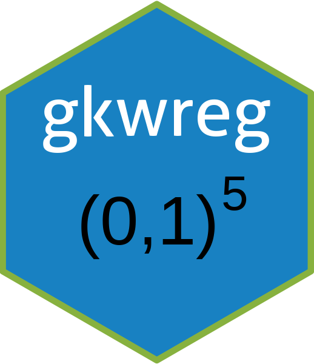

# gkwreg: Generalized Kumaraswamy Regression Models 

[](https://CRAN.R-project.org/package=gkwreg)
[](https://github.com/evandeilton/gkwreg/actions/workflows/R-CMD-check.yaml)
[](https://cran.r-project.org/package=gkwreg)

## Overview

The `gkwreg` package provides a robust and efficient framework for
modeling data restricted to the standard unit interval $(0, 1)$, such as
proportions, rates, fractions, or indices. While the Beta distribution
is commonly used for such data, `gkwreg` focuses on the **Generalized
Kumaraswamy (GKw)** distribution family, offering enhanced flexibility
by encompassing several important bounded distributions (including Beta
and Kumaraswamy) as special cases.

The package facilitates both distribution fitting and regression
modeling with potentially all distribution parameters modeled as
functions of covariates using various link functions. Estimation is
performed efficiently via **Maximum Likelihood** leveraging the
**Template Model Builder (TMB)** framework, which utilizes automatic
differentiation for superior speed, accuracy, and stability.

## Key Features

- **Flexible Distribution Family:** Model data using the 5-parameter
  Generalized Kumaraswamy (GKw) distribution and its seven key nested
  sub-families:

  | Distribution | Code | Parameters Modeled | Fixed Parameters | \# Par. |
  |:---|:---|:---|:---|:---|
  | Generalized Kumaraswamy | `gkw` | `alpha`, `beta`, `gamma`, `delta`, `lambda` | `None` | 5 |
  | Beta-Kumaraswamy | `bkw` | `alpha`, `beta`, `gamma`, `delta` | `lambda` = 1 | 4 |
  | Kumaraswamy-Kumaraswamy | `kkw` | `alpha`, `beta`, `delta`, `lambda` | `gamma` = 1 | 4 |
  | Exponentiated Kumaraswamy | `ekw` | `alpha`, `beta`, `lambda` | `gamma` = 1, `delta` = 0 | 3 |
  | McDonald / Beta Power | `mc` | `gamma`, `delta`, `lambda` | `alpha` = 1, `beta` = 1 | 3 |
  | Kumaraswamy | `kw` | `alpha`, `beta` | `gamma` = 1, `delta` = 0, `lambda` = 1 | 2 |
  | Beta | `beta` | `gamma`, `delta` | `alpha` = 1, `beta` = 1, `lambda` = 1 | 2 |

- **Advanced Regression Modeling (`gkwreg`):** Independently model each
  relevant distribution parameter as a function of covariates using a
  flexible formula interface:

  ``` r
  y ~ alpha_terms | beta_terms | gamma_terms | delta_terms | lambda_terms
  ```

- **Multiple Link Functions:** Choose appropriate link functions for
  each parameter, including:

  - `log` (default for all parameters)
  - `logit`, `probit`, `cloglog` (with optional scaling)
  - `identity`, `inverse`, `sqrt`

- **Efficient Estimation:** Utilizes the TMB package for fast and stable
  Maximum Likelihood Estimation, leveraging automatic differentiation
  for precise gradient and Hessian calculations.

- **Standard R Interface:** Provides familiar methods like `summary()`,
  `predict()`, `plot()`, `coef()`, `vcov()`, `logLik()`, `AIC()`,
  `BIC()`, `residuals()` for model inspection, inference, and
  diagnostics.

- **Distribution Utilities:** Implements standard `d*`, `p*`, `q*`, `r*`
  also as analytical log-likelihood `ll*`, gradient `gr*` and hessian
  `hs*` functions for all supported distributions in C++/RcppArmadillo.

## Installation

``` r
# Install the stable version from CRAN:
install.packages("gkwreg")

# Or install the development version from GitHub:
# install.packages("devtools")
devtools::install_github("evandeilton/gkwreg")
```

## Mathematical Background

### The Generalized Kumaraswamy (GKw) Distribution

The GKw distribution is a flexible five-parameter distribution for
variables on $(0, 1)$. Its cumulative distribution function (CDF) is
given by:

$$F(x; \alpha, \beta, \gamma, \delta, \lambda) = I_{[1-(1-x^{\alpha})^{\beta}]^{\lambda}}(\gamma, \delta)$$

where $I_z(a,b)$ is the regularized incomplete beta function, and
$\alpha, \beta, \gamma, \delta, \lambda > 0$ are the distribution
parameters. The corresponding probability density function (PDF) is:

$$f(x; \alpha, \beta, \gamma, \delta, \lambda) = \frac{\lambda \alpha \beta x^{\alpha-1}}{B(\gamma, \delta)} (1-x^{\alpha})^{\beta-1} [1-(1-x^{\alpha})^{\beta}]^{\gamma\lambda-1} \{1-[1-(1-x^{\alpha})^{\beta}]^{\lambda}\}^{\delta-1}$$

where $B(\gamma, \delta)$ is the beta function.

The five parameters collectively provide exceptional flexibility in
modeling distributions on $(0, 1)$: - Parameters alpha and beta
primarily govern the basic shape inherited from the Kumaraswamy
distribution - Parameters gamma and delta affect tail behavior and
concentration around modes - Parameter lambda introduces additional
flexibility, influencing skewness and peak characteristics

This parameterization allows the GKw distribution to capture a wide
spectrum of shapes, including symmetric, skewed, unimodal, bimodal,
J-shaped, U-shaped, and bathtub-shaped forms.

## Regression Framework

In the regression setting, we assume that the response variable
$y_i \in (0,1)$ follows a distribution from the GKw family with
parameters
$\theta_i = (\alpha_i, \beta_i, \gamma_i, \delta_i, \lambda_i)^{\top}$.
Each parameter $\theta_{ip}$ (where $p \in \{$alpha, beta, gamma, delta,
lambda$\}$) can depend on covariates through a link function
$g_p(\cdot)$:

$$g_p(\theta_{ip}) = \eta_{ip} = \mathbf{x}_{ip}^{\top}\boldsymbol{\beta}_p$$

where $\eta_{ip}$ is the linear predictor, and $\boldsymbol{\beta}_p$ is
the vector of regression coefficients. Equivalently,
$\theta_{ip} = g_p^{-1}(\eta_{ip})$. The default link function is `log`
for all parameters, ensuring the positivity constraint.

Parameters are estimated using maximum likelihood, with the
log-likelihood function:

$$\ell(\Theta; \mathbf{y}, \mathbf{X}) = \sum_{i=1}^{n} \log f(y_i; \theta_i)$$

where each parameter $\theta_{ip}$ depends on $\Theta$ (the complete set
of regression coefficients) via the link functions and linear
predictors.

## Computational Engine: TMB

The package uses **Template Model Builder (TMB)** ([Kristensen et
al. 2016](https://doi.org/10.18637/jss.v070.i05)) as its computational
backend. TMB translates the statistical model into C++ templates and
uses **Automatic Differentiation (AD)** to compute exact gradients and
Hessians, providing several advantages:

- **Speed:** AD combined with compiled C++ is significantly faster than
  numerical differentiation or pure R implementations
- **Accuracy:** AD provides derivatives accurate to machine precision
- **Stability:** Precise derivatives improve optimization stability and
  convergence reliability
- **Scalability:** Efficiently handles models with many parameters

## Examples

### Regression Modeling

Model parameters of a GKw family distribution as functions of
covariates:

``` r
library(gkwreg)

# Simulate data for a Kumaraswamy regression model
set.seed(123)
n <- 100
x1 <- runif(n, -2, 2)
x2 <- rnorm(n)

# Simulate true parameters (using log link)
alpha_true <- exp(0.8 + 0.3 * x1 - 0.2 * x2) 
beta_true  <- exp(1.2 - 0.4 * x1 + 0.1 * x2)

# Generate response
y <- rkw(n, alpha = alpha_true, beta = beta_true)
y <- pmax(pmin(y, 1 - 1e-7), 1e-7)  # Ensure y in (0, 1)
df1 <- data.frame(y = y, x1 = x1, x2 = x2)

# Fit Kumaraswamy regression: alpha ~ x1 + x2, beta ~ x1 + x2
kw_model <- gkwreg(y ~ x1 + x2 | x1 + x2, data = df1, family = "kw")
summary(kw_model)
```

### Real Data Analysis

``` r
# Food Expenditure Data
library(gkwreg)
data("FoodExpenditure", package = "betareg")
FoodExpenditure$y <- FoodExpenditure$food/FoodExpenditure$income

# Fit models from different GKw families
kkw_model <- gkwreg(y ~ income, data = FoodExpenditure, family = "kkw")
ekw_model <- gkwreg(y ~ income, data = FoodExpenditure, family = "ekw")
kw_model <- gkwreg(y ~ income, data = FoodExpenditure, family = "kw")

# Compare models
data.frame(
  logLik = rbind(logLik(kkw_model), logLik(ekw_model), logLik(kw_model)),
  AIC = rbind(AIC(kkw_model), AIC(ekw_model), AIC(kw_model)),
  BIC = rbind(BIC(kkw_model), BIC(ekw_model), BIC(kw_model))
)

# Summary
summary(kw_model)

res <- residuals(kw_model, type = "quantile")

# Visual diagnostics
plot(kw_model)

# Predicted
pred <- predict(kw_model)
```

### Distribution Fitting

Fit a GKw family distribution to univariate data (no covariates):

``` r
# Simulate data from Beta(2, 3)
set.seed(2203)
y_beta <- rbeta_(1000, gamma = 2, delta = 3)

# Fit Beta and Kumaraswamy distributions
fit_beta <- gkwfit(data = y_beta, family = "beta")
fit_kw <- gkwfit(data = y_beta, family = "kw")

# Compare models
summary(fit_beta)
summary(fit_kw)
AIC(fit_beta)
AIC(fit_kw)
```

## Diagnostic Methods

The package provides several diagnostic tools for model assessment:

``` r
# Residual analysis
model <- gkwreg(y ~ x1 | x2, data = mydata, family = "kw")
res <- residuals(model, type = "quantile")  # Randomized quantile residuals

# Visual diagnostics
plot(model)  # QQ-plot, residuals vs. fitted, etc.

pred <- predict(model, type = "response")
```

## References

- Cordeiro, G. M., & de Castro, M. (2011). A new family of generalized
  distributions. *Journal of Statistical Computation and Simulation*,
  81(7), 883-898. <https://doi.org/10.1080/00949650903530745>

- Carrasco, J. M. F., Ferrari, S. L. P., & Cordeiro, G. M. (2010). A new
  generalized Kumaraswamy distribution. *arXiv preprint
  arXiv:1004.0911*.

- Jones, M. C. (2009). Kumaraswamy’s distribution: A beta-type
  distribution with some tractability advantages. *Statistical
  Methodology*, 6(1), 70-81.
  <https://doi.org/10.1016/j.stamet.2008.04.001>

- Kristensen, K., Nielsen, A., Berg, C. W., Skaug, H., & Bell, B. M.
  (2016). TMB: Automatic Differentiation and Laplace Approximation.
  *Journal of Statistical Software*, 70(5), 1-21.
  <https://doi.org/10.18637/jss.v070.i05>

- Kumaraswamy, P. (1980). A generalized probability density function for
  double-bounded random processes. *Journal of Hydrology*, 46(1-2),
  79-88. <https://doi.org/10.1016/0022-1694(80)90036-0>

- Ferrari, S. L. P., & Cribari-Neto, F. (2004). Beta regression for
  modelling rates and proportions. *Journal of Applied Statistics*,
  31(7), 799-815. <https://doi.org/10.1080/0266476042000214501>

- Cribari-Neto, F., & Zeileis, A. (2010). Beta Regression in R. *Journal
  of Statistical Software*, 34(2), 1-24.
  <https://doi.org/10.18637/jss.v034.i02>

- Lopes, J. E. (2025). Generalized Kumaraswamy Regression Models with
  gkwreg. *Journal of Statistical Software*, forthcoming.
  <https://doi.org/10.18637/jss.v000.i00>

## Comparing with Other Packages

The `gkwreg` package complements and extends existing approaches for
modeling bounded data:

| Feature | gkwreg | betareg | gamlss | brms |
|:---|:---|:---|:---|:---|
| Distribution Family | GKw hierarchy (7 distributions) | Beta | Multiple | Multiple |
| Estimation Method | MLE via TMB | MLE | MLE/GAMLSS | Bayesian |
| Parameter Modeling | All parameters | Mean, precision | All parameters | All parameters |
| Computation Speed | Fast (TMB + AD) | Fast | Moderate | Slow (MCMC) |
| Default Link | log | logit (mean) | Distribution-specific | Distribution-specific |
| Random Effects | No | No | Yes | Yes |

## Contributing

Contributions to `gkwreg` are welcome! Please feel free to submit issues
or pull requests on the [GitHub
repository](https://github.com/evandeilton/gkwreg).

## License

This package is licensed under the MIT License. See the
[LICENSE.md](LICENSE.md) file for details.

## Author and Maintainer

Lopes, J. E. (<evandeilton@gmail.com>)  
LEG - Laboratório de Estatística e Geoinformação  
UFPR - Universidade Federal do Paraná, Brazil
